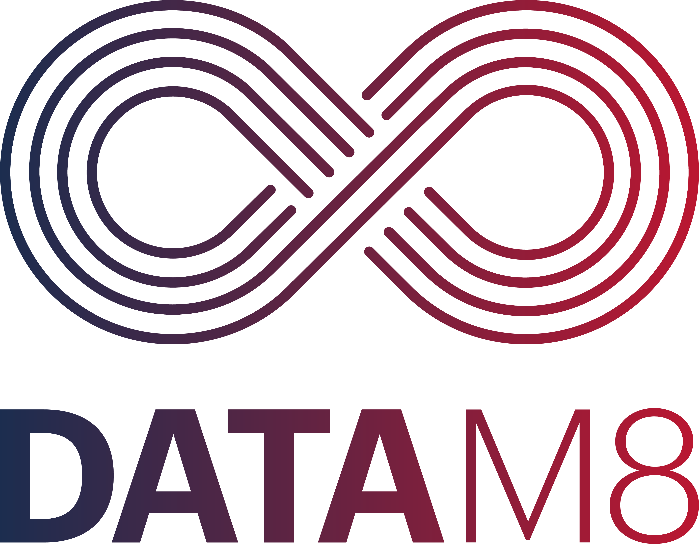

# ORAYLIS _DataM8_ Sample Solution for Azure Databricks

_DataM8_ is an exceptional open-source data automation tool available for free!

Its primary goal is to streamline the setup of data warehouses on different platforms, catering to a wide range of users, from small to enterprise-scale data warehouses. Inspired by ORAYLIS' best practices and driven by a passion for data engineering, _DataM8_ focuses on elevating data platform quality while significantly minimizing repetitive tasks. With its expandable solution, users can effortlessly automate data warehouse workflows on their preferred target platform, making it a valuable asset for data engineers and organizations alike.

## Contributors

This sample solution for _DataM8_ is made possible with contributions from the following individuals:

- Michael Kuhlen (ORAYLIS GmbH)
- Lasse Jenzen (ORAYLIS GmbH)
- Jan Degenhard (ORAYLIS GmbH)
- Markus Riehle (ORAYLIS GmbH)
- Marco Wotruba (ORAYLIS GmbH)

## Comprehensive Documentation for the Azure Databricks Sample Solution

This section provides a wealth of detailed information on the architecture, functionalities, and varied features of the Azure Databricks sample solution. It is designed to be a vital resource for both newcomers and seasoned users, offering clear guidance and insights on how to harness the full potential of the _DataM8_ sample solution:

1. **Solution Structure:** _DataM8_ is structured to efficiently organize and manage your data warehouse project. For an in-depth understanding, explore this 📜[Solution Structure Guide](https://github.com/oraylis/automation/blob/main/docs/DataM8.md).
2. **Quick Start Guide:** This guide covers the essentials for setting up Azure Databricks prerequisites, whether in the ORAYLIS IT-DEV environment or your own setup. Navigate through the setup process with this 📜[Quick Start Guide](./docs/quickstart.md).
3. **Template Generation:** Discover templates for generating a sample Azure Databricks solution (databricks-lake), providing a practical starting point for your projects. Learn more with this 📜[Template Generation Guide](./Generate/databricks-lake/README.md).

## License

Copyright 2024 ORAYLIS GmbH

Permission is hereby granted, free of charge, to any person obtaining a copy of this software and associated
documentation files (the "Software"), to deal in the Software without restriction, including without limitation the
rights to use, copy, modify, merge, publish, distribute, sublicense, and/or sell copies of the Software, and to permit
persons to whom the Software is furnished to do so, subject to the following conditions:

The above copyright notice and this permission notice shall be included in all copies or substantial portions of the
Software.

THE SOFTWARE IS PROVIDED "AS IS", WITHOUT WARRANTY OF ANY KIND, EXPRESS OR IMPLIED, INCLUDING BUT NOT LIMITED TO THE
WARRANTIES OF MERCHANTABILITY, FITNESS FOR A PARTICULAR PURPOSE AND NONINFRINGEMENT. IN NO EVENT SHALL THE AUTHORS OR
COPYRIGHT HOLDERS BE LIABLE FOR ANY CLAIM, DAMAGES OR OTHER LIABILITY, WHETHER IN AN ACTION OF CONTRACT, TORT OR
OTHERWISE, ARISING FROM, OUT OF OR IN CONNECTION WITH THE SOFTWARE OR THE USE OR OTHER DEALINGS IN THE SOFTWARE.
