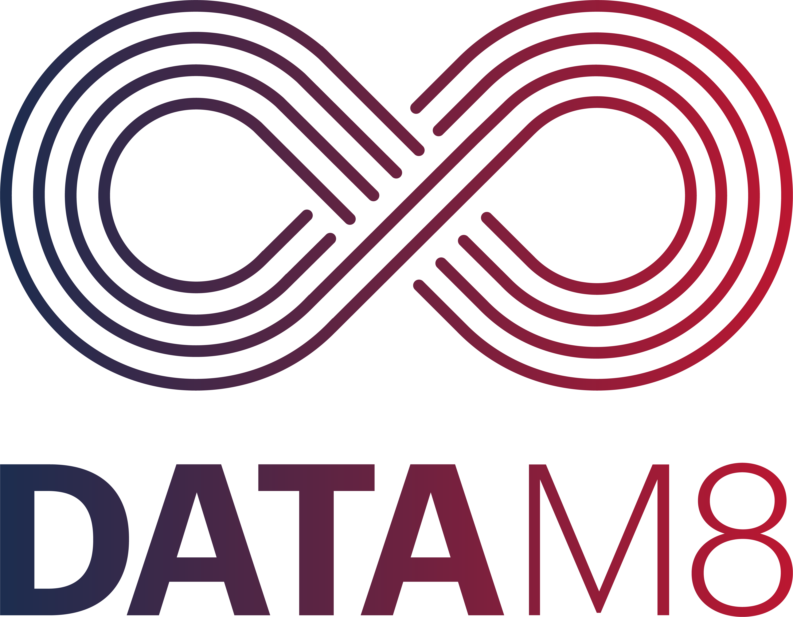

# ORAYLIS DataM8 Sample Solution for Azure Databricks

DataM8 is an open-source data automation tool for building metadata-driven data
platforms. This sample solution demonstrates generation for Databricks, Power BI
Tabular, and model documentation.

> [!IMPORTANT]
> The main branch may contain active development and may not always be stable.
> Prefer [releases] or [version tags] when referencing a fixed schema or sample state.

## Documentation

Start with the [documentation index](./docs/index.md).

- [Getting Started](./docs/getting-started.md): local setup, repository structure, and first generation run.
- [Quickstart Deployment](./docs/quickstart.md): Azure, Databricks, Key Vault, and CI/CD setup.
- [Template and Payload Development](./docs/howto-template-and-payload-development.md): beginner-friendly tutorial with examples.
- [Generator Reference](./docs/reference/generator-contracts.md): payload contracts, target structure, and validation rules.
- [Target Overview](./docs/reference/targets.md): active generator targets and their architecture documents.

## Active Targets

Generator targets are defined in [`ORAYLISDatabricksSample.dm8s`](./ORAYLISDatabricksSample.dm8s):

- `databricks` -> `Generate/databricks` -> `Output/databricks`
- `powerbi` -> `Generate/powerbi-tabular` -> `Output/powerbi-tabular`
- `docs` -> `Generate/docs` -> `Output/docs`

## Contributors

This sample solution for DataM8 is made possible with contributions from:

- Michael Kuhlen (ORAYLIS GmbH)
- Lasse Jenzen (ORAYLIS GmbH)
- Jan Degenhard (ORAYLIS GmbH)
- Markus Riehle (ORAYLIS GmbH)
- Marco Wotruba (ORAYLIS GmbH)

[releases]: https://github.com/oraylis/datam8-sample-solution/releases
[version tags]: https://github.com/oraylis/datam8-sample-solution/tags
