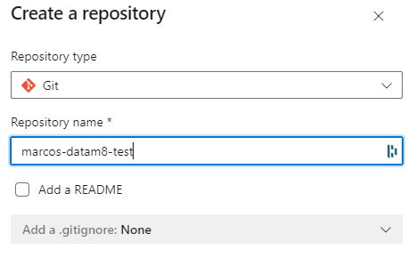
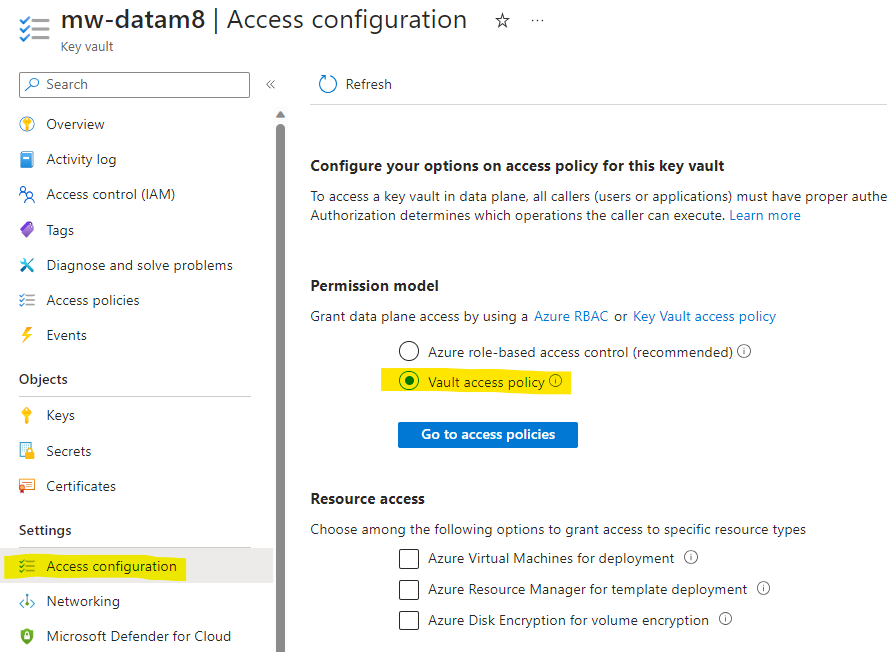
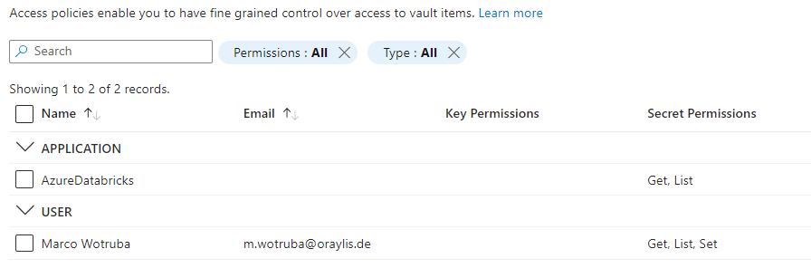
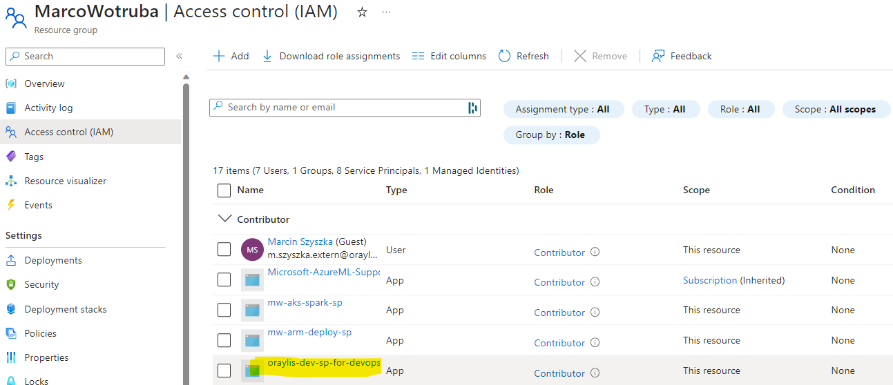
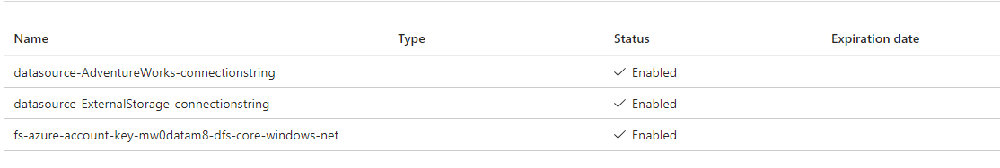
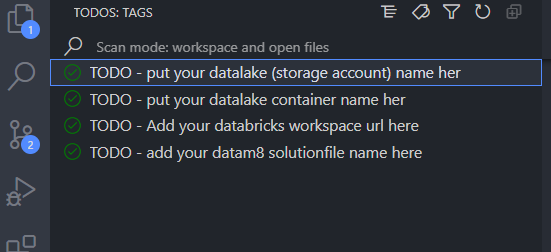

# Quickstart Tutorial for DataM8 Deployment

## Prerequisites for Alternate Environment Deployment
Before deploying DataM8 to a different environment, ensure you have:
- A designated DevOps Project for the solution.
- DevOps Service Connections for Databricks and GitHub access.
- Access to Azure resources like Databricks, KeyVault, or permissions to create them.

## Git Version Control Setup

### 1. Accessing the DevOps Project
- Navigate to [DataM8 Beta Project](https://dev.azure.com/mwotruba0925/datam8-beta).
- Contact Marco Wotruba (ORAYLIS GmbH) for access issues.

### 2. Repository Creation for Testing
- Create a new repository in DevOps without interfering with others' work.
- Follow standard repository creation steps, as shown:

  

- Initialize and push the repository with these commands:

```console
git init
git add *
git commit -m "first commit"
git branch -M main
git remote add origin https://mwotruba0925@dev.azure.com/mwotruba0925/datam8-beta/_git/marcos-datam8-test
git push -u origin main
```


## Setting Up Databricks Solution in ORAYLIS IT - DEV

### 1. Resource Group Setup
Create the following in your ORAYLIS IT resource group:
- A Databricks Workspace with default settings.
- A storage account with a "data" container.
- A KeyVault with "Vault access policy" permission model.

  

### 2. Secret Scope Creation in Azure Databricks
- Visit your Databricks URL:

  `[Databricks Secret Scope Creation](https://<your url>.azuredatabricks.net/#secrets/createScope)`

- Name the scope "keyvault" and use values from your KeyVault.

### 3. Configuring Azure KeyVault
- Add Get, Set, and List access policy for your user:

  

### 4. Service Principal Permission Assignment
- Grant "Contributor" role to "oraylis-dev-sp-for-devops" Service Principal:

  

## Adding Secrets to Azure KeyVault
For each "DataSource" in DataM8 Modeller and the target datalake:
- Create a secret named "datasource-<datasource name>-connectionstring".
- Add the datalake account's access key as "fs-azure-account-key-<datalake account name>-dfs-core-windows-net".

  

## Configuring DataM8 for CI/CD
1. Search the solution for "TODO" comments and follow the instructions. Use the [TODO Tree extension](https://marketplace.visualstudio.com/items?itemName=Gruntfuggly.todo-tree) in VS Code.

   

This tutorial provides a detailed guide for setting up and deploying the DataM8 solution in an alternate environment.
