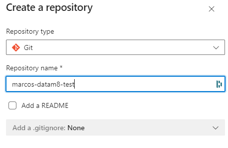
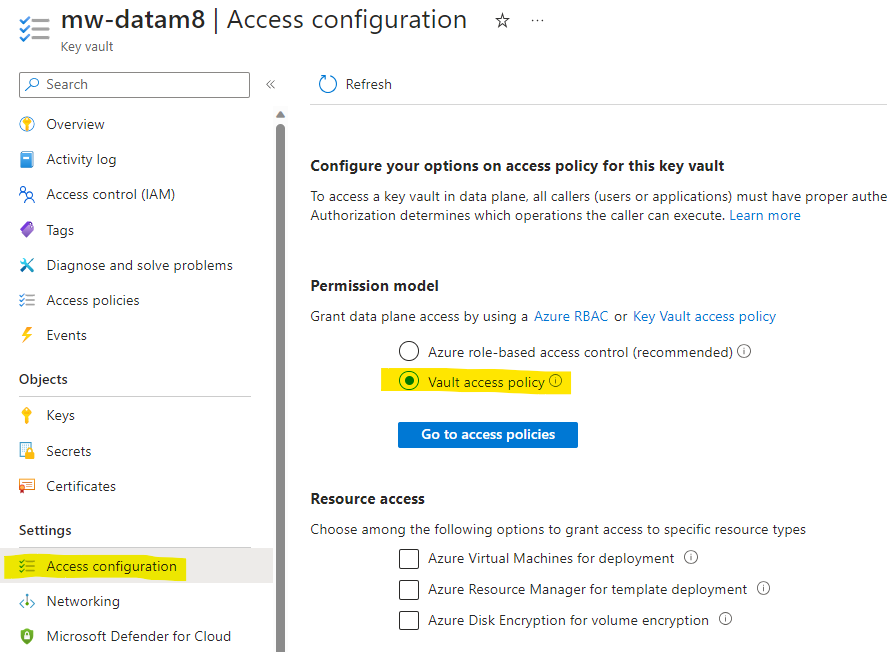
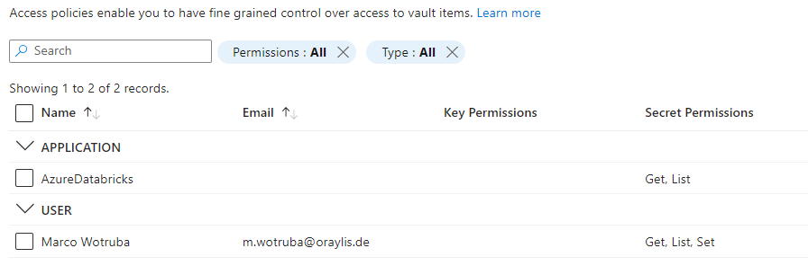
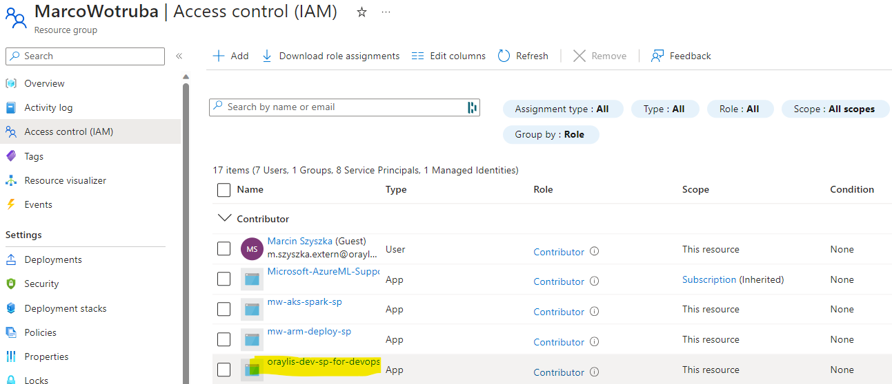
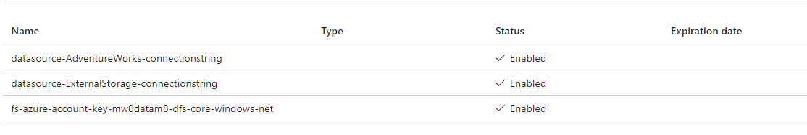
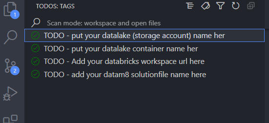

# Quickstart Tutorial for DataM8 Deployment

## Prerequisites for Alternate Environment Deployment

Before deploying DataM8 to another environment, ensure you have:
- a dedicated DevOps project for the solution
- DevOps service connections for Databricks and GitHub
- access to Azure resources (Databricks, Key Vault, Storage) or permissions to create them

## Git Version Control Setup

### 1. Accessing the DevOps project
- Navigate to your Azure DevOps project (example: DataM8 Beta project).
- Contact your project owner/admin for access.

### 2. Repository creation for testing
- Create a dedicated repository so you do not interfere with other workstreams.



- Initialize and push the repository:

```console
git init
git add .
git commit -m "first commit"
git branch -M main
git remote add origin <your-remote-url>
git push -u origin main
```

## Setting Up Databricks Solution in an IT/Dev Subscription

### 1. Resource group setup
Create the following resources:
- Databricks workspace
- storage account with a `data` container
- Key Vault with an access-policy-based permission model



### 2. Secret scope creation in Azure Databricks
- Open your Databricks workspace URL:

`https://<your-workspace>.azuredatabricks.net/#secrets/createScope`

- Create scope `keyvault` and bind it to your Key Vault.

### 3. Configuring Azure Key Vault
- Grant your user `Get`, `Set`, and `List` secret permissions.



### 4. Service principal permission assignment
- Grant your CI/CD service principal at least `Contributor` role on required resources.



## Adding Secrets to Azure Key Vault

For each `DataSource` in the model and the target data lake:
- Create secret `datasource-<datasource-name>-connectionstring`.
- Add data lake access key as `fs-azure-account-key-<datalake-account-name>-dfs-core-windows-net`.



## Configuring DataM8 for CI/CD

1. Search the solution for `TODO` comments and resolve them.
2. Optional: use the [TODO Tree extension](https://marketplace.visualstudio.com/items?itemName=Gruntfuggly.todo-tree) in VS Code.



## Next Reading

- [Template Development How-To](./template-development-howto.md)
- [Databricks Target Architecture](../Generate/databricks-lake/ARCHITECTURE.md)
